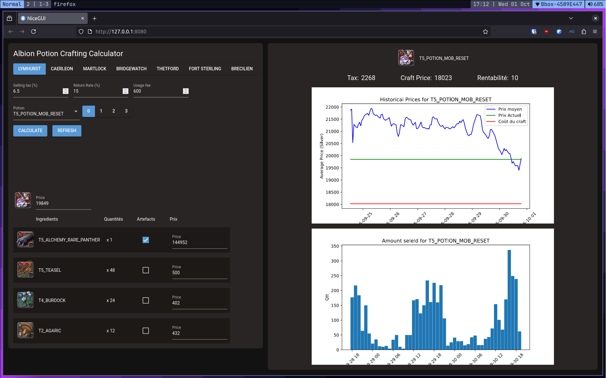

# Albion-Potion-Crafting-Calculator
A nice python ui to help me craft potions in albion online 3

### What it uses
All data are requested from [the Albion Data Project](https://www.albion-online-data.com/)\
Very useful: the items' data from [the Albion Data Project's github](https://github.com/ao-data/ao-bin-dumps)\
Images from [Albion Online render service](https://wiki.albiononline.com/wiki/API:Render_service)\
Using [nicegui](https://nicegui.io/) with python\

### What it can do
*everything you need to maximise your profits in game :)*
- Show any potion crafts, with any enchentement
- Auto complete with actual item prices and fallback to average if there is no data (it can be overwritten if wanted)
- Exact craft tax, cost and etc. according to the return rate and plot's usage fee, in any city
- Nice average prices over time plotting, along with amount sold

